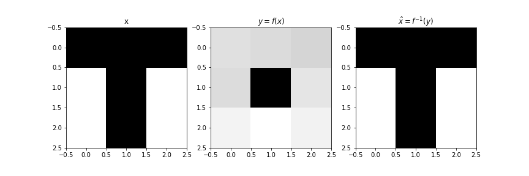

# iResNetLab


A simple unofficial iResNet library that intend to make iResNet easy to use.

# Analogy to `torch.nn`

| pytorch                      | iResNetLab                     |
| ---------------------------- | ------------------------------ |
| `nn.Linear(dim_in, dim_out)` | `iResNet.FCN(dim_in, dim_out)` |
| `nn.Conv1d(channel_in, channel_out, kernel_size)`| `iResNet.Conv1d(channel, kernel_size)`|
| `nn.Conv2d(channel_in, channel_out, kernel_size)`| `iResNet.Conv2d(channel, kernel_size)`|
| `nn.Sequential(*modules)`    | `iResNet.Sequential(*modules)` |

## Fully connected layers


Define a fully connected i-ResNet:

```python
model = iResNet.FCN(2, 2)
model.train()
```

Forward computing:

```python
# input data
x = torch.Tensor([[1,2],
                  [3,4]])
x.requires_grad = True # x must requires gradient

# forward
y, logp, logdet = model(x)
# output:
>>> y = tensor([[1.3179, 2.2021],
>>>             [3.3864, 4.2015]], grad_fn=<SliceBackward>)
>>> logp = tensor([0., 0.], grad_fn=<AddBackward0>)
>>> logdet = tensor([0.0153, 0.1178], grad_fn=<AddBackward0>)
```

Inverse process:

```python
# inverse
model.inverse(y.detach())
# output:
>>> output:
>>> tensor([[1., 2.],
>>>         [3., 4.]])
```

The `iResNet.FCN` provides a i-ResNet block that has the form of `model(x, log_p0, log_det_J0) --> y, log_p, log_det_J`.
The input not only have the feature `x`, but also have the `log_p0` and `log_det_J0`.

The `log_p0` is the log probability inherited from previous abandoned features. 
The `log_det_J` is the log(det J) from previous layers. They both be 0 by default.

## Sequential


Defining a sequential of FCN i-ResNet:

```python
model = iResNet.Sequential(iResNet.FCN(2, 2),
                           iResNet.FCN(2, 2),
                           iResNet.FCN(2, 2))
model.train()
```

Forward and inverse process:

```python
# input data
x = torch.Tensor([[1,2],
                  [3,4]])
x.requires_grad = True
y, logp, logdet = model(x)

model.inverse(y.detach())
# output:
>>> output:
>>> tensor([[1., 2.],
>>>         [3., 4.]])
```

The modules for `iResNet.Sequential` must have this form: `model(x, log_p0, log_det_J0) --> y, log_p, log_det_J`. 
It must contains following methods:

1. `self.inverse(y) --> x`: a inverse method
2. `self.forward(x, log_p0, log_det_J0) --> y, log_p, log_det_J`: a forward method

## 1D Convolutional Network


Set model:

```python
model = iResNet.Sequential(iResNet.Conv1d(channel=2, kernel_size=3),
                           iResNet.Conv1d(channel=2, kernel_size=1),
                           iResNet.Conv1d(channel=2, kernel_size=3))
```

Set input, and compute the forward:

```python
x = torch.Tensor([[[1,2,3,4,5],[-1,-2,-3,-4,-5]], [[1,2,0,4,5],[-1,-2,0,-4,-5]]])
x.requires_grad = True

y, logp, logdet = model(x)
```

Inverse:

```python
model.inverse(y)

# output:
>>> tensor([[[ 1.0000e+00,  2.0000e+00,  3.0000e+00,  4.0000e+00,  5.0000e+00],
>>>          [-1.0000e+00, -2.0000e+00, -3.0000e+00, -4.0000e+00, -5.0000e+00]],
>>> 
>>>         [[ 1.0000e+00,  2.0000e+00, -1.4901e-08,  4.0000e+00,  5.0000e+00],
>>>          [-1.0000e+00, -2.0000e+00, -7.4506e-09, -4.0000e+00, -5.0000e+00]]])
```

## 2D Convolutional Network



> The forward and inverse process for a simple image

Set a model:

```python
model = iResNet.Sequential(iResNet.Conv2d(channel=2, kernel_size=3),
                           iResNet.Conv2d(channel=2, kernel_size=3),
                           iResNet.Conv2d(channel=2, kernel_size=3),
                           iResNet.Conv2d(channel=2, kernel_size=3),
                           iResNet.Conv2d(channel=2, kernel_size=3),
                           iResNet.Conv2d(channel=2, kernel_size=3)
                          )
```

Forward process:

```python
x = torch.Tensor([[[[1,1,1],
                    [0,1,0],
                    [0,1,0]],

                   [[0,1,0],
                    [1,1,1],
                    [0,1,0]]]])
x.requires_grad = True

y, logp, logdet = model(x)
# output:
>>> logdet = tensor([-3.7631], grad_fn=<AddBackward0>)
```

Inverse Process:

```python
xhat = model.inverse(y)

# output:
>>> tensor([[[[ 1.0000e+00,  1.0000e+00,  1.0000e+00],
>>>           [-8.9407e-08,  1.0000e+00, -3.5390e-08],
>>>           [ 1.8626e-07,  1.0000e+00,  1.6391e-07]],
>>> 
>>>          [[ 7.4506e-08,  1.0000e+00,  2.9802e-08],
>>>           [ 1.0000e+00,  1.0000e+00,  1.0000e+00],
>>>           [ 7.4506e-09,  1.0000e+00,  1.4901e-08]]]])
```

## Resize Layers for Convolutional Layers


* [PixelUnshuffle](https://pytorch.org/docs/stable/generated/torch.nn.PixelUnshuffle.html?highlight=pixelshuffle), [PixelShuffle](https://pytorch.org/docs/stable/generated/torch.nn.PixelShuffle.html?highlight=pixelshuffle#torch.nn.PixelShuffle)
    * For 1-d version: [serkansulun/pytorch-pixelshuffle1d](https://github.com/serkansulun/pytorch-pixelshuffle1d)
    * https://arxiv.org/pdf/1609.05158.pdf


> Related work: https://arxiv.org/pdf/2006.14200.pdf

## Batch Normalization


`iResNet.BatchNorm1d()`

## Invertible 1x1 Convolution

> reference: https://arxiv.org/pdf/1807.03039.pdf


## Real NVP

`iResNet.RealNVP(dim=None, f_log_s=None, f_t=None, k=4, mask=None, clip=1)`

Parameters:

* `dim`: dimension of the input/output;
* `f_log_s`, `f_t`: function for s and t. If they are `None`, they will be generated automatically. The generated shape is determined by `k`;
* `mask`: the mask for Real NVP. If it is `None`, a chessboard mask will be generated;
* `clip`: Clipping the log(s) to `[-clip, clip]`, to avoid large numbers.

Shape:

* input: (\*, dim)
* output: (\*, dim){output}, (\*){log(p)}, (\*){log(|det J|)}

Example:

```python
model = iResNet.Sequential(iResNet.RealNVP(4),
                           iResNet.RealNVP(4))

x = torch.Tensor([[1,2,3,-1],
                  [4,5,-6, 6]])

y, log_p, logdet = model(x)
model.inverse(y)

>>> tensor([[ 1.0000,  2.0000,  3.0000, -1.0000],
>>>         [ 4.0000,  5.0000, -6.0000,  6.0000]], grad_fn=<AddBackward0>)
```